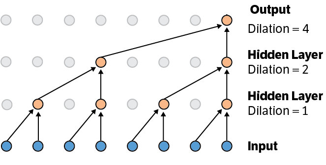
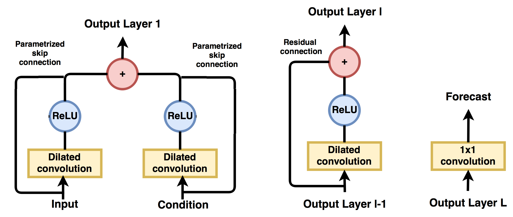
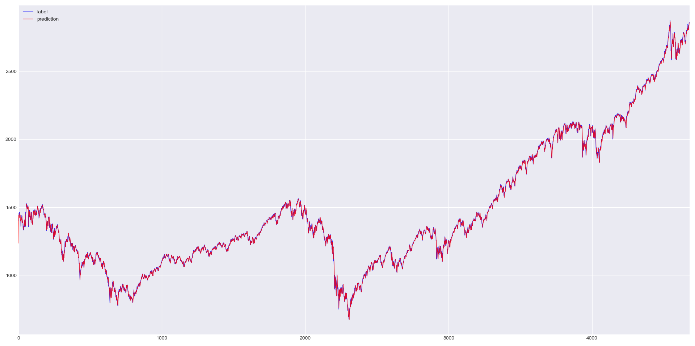
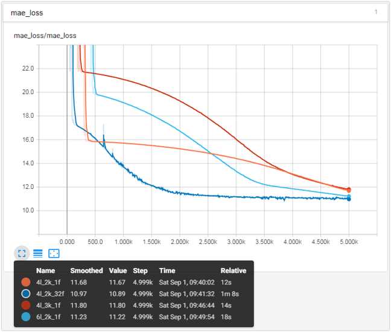

# Temporal Convolutional Nueral Network for Time-Series Prediction

Tensorflow implementation of the temporal convolutional nueral network (temporal/causal CNN) for time series prediction based on:

-   A. Borovykh, S. Bohte, and C. W. Oosterlee, "Conditional Time Series Forecasting with Convolutional Neural Networks," arXiv:1703.04691 [stat.ML], Mar. 2017.

The work uses the 1-D dilated CNN, which is illustrated in Fig. 1. Then, with kernal size _k_, the reception field _r_ of a nueron in layer _L_ is of size `r = k * 2^(L-1)` as the dilation rate grows exponetially across layers.


**Fig. 1**

The structure of the nework is illustrated in Fig. 2. The input layer takes both a input serie and a conditional serie (but can be extended to aribitrary number of input series). Each input serie is processed by both a dialted CNN with ReLU activation and a parameterized skip connection (1 by 1 convolution). All the outputs are then merged into a [1\*N\*k] tensor (N is the length of the time serie and k is the kernal size) which is also the ouput of the layer.

Each itermediate layer takes a similar structure producing a [1\*N\*k] output tensor but uses a residual connection instead of the skip connection in the first layer. Finally, the last layer generates the [1\*N\*1] forecast with a 1 by 1 convolution.


**Fig. 2**

## module API

There are three classes in the module.

- ```Conv1D``` is a wrapper class of ```tf.layers.Conv1D``` but applied the 'causal' padding and by default with a truncated normal kernal initializer and a L2 kernel regularizer.

- ```DCNBlock``` inherits ```tf.layers.Layer``` and defines the dilated network block illustrated in Fig. 2. The block takes an extra boolean parameter of ```first_layer``` to decide the internal structure.

- ```TemporalConvNet``` also inherits ```tf.layers.Layer``` and implements the default network structure described in the mentioned paper using the ```DCNBlock```.

More details please refer to the code and the demo.

## Demo Usage

A demo is provided in the ```demo.py```, which builds a four layer temporal CNN with ```kernal_size=2``` and ```n_filter=1```, in accordance with the settings used in the paper. The demo 'S&P 500' dataset has only a single time series so here we do a 1-step-ahead prediction. The demo should produces a prediction serie showed as the red line in Fig. 3 (the ground truth is in blue color but is overlapped). The mean absolute error is currently under 12. Try increase the performance with different settings (Fig. 4).

Running the demo will also generate log files for tensorboard visualization. Simply command ```tensorboard --logdir [path]``` to see the results in broswer.


**Fig. 3**


**Fig. 4**

## License

MIT License
